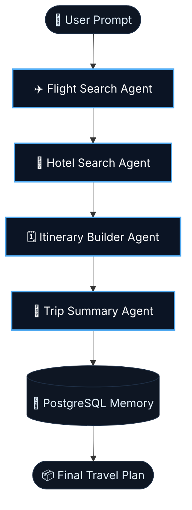

<div align="center">

# ✈️ AI Multi-Agent Travel Planning System

<p align="center">
  
  
  
  
  
  
</p>

<p align="center">
  
  
  
  
</p>

<br/>

> **Four specialized AI agents. One perfect trip.**  
> A production-grade multi-agent system that searches flights, finds hotels, builds day-by-day itineraries, and delivers a complete travel plan — all powered by LangGraph + Llama 3.3 70B.


</div>

---

## 📸 Preview

> _A premium dark-themed Streamlit interface with glassmorphism layouts, real-time agent status, and PDF export._

---

## 🧠 How It Works

The system uses a **sequential LangGraph state graph** where each agent enriches a shared state before handing off to the next:



| Agent | Role |
|---|---|
| ✈️ **Flight Search Agent** | Queries AviationStack API for live flight options |
| 🏨 **Hotel Search Agent** | Finds top hotel deals via Tavily real-time search |
| 🗓️ **Itinerary Builder Agent** | Generates structured day-by-day schedules |
| 🧠 **Trip Summary Agent** | Compiles everything into a clean markdown travel guide |
| 🐘 **PostgreSQL Memory** | Stores conversation checkpoints & session history |

---

## ✨ Features

| Feature | Description |
|---|---|
| 🤖 **Multi-Agent Architecture** | 4 specialized LangGraph agents working in sequence |
| 🧠 **Long-Term Memory** | PostgreSQL-backed session checkpoints across conversations |
| 📄 **PDF Export** | Beautiful, printable travel plans generated on the fly |
| 🎨 **Theme Toggle** | Premium Dark, Elegant Light & Charcoal Grayscale modes |
| ⚡ **Auto User ID** | Session-level ID generation that scales automatically |
| 🌐 **Dual Launch Mode** | Run via Terminal CLI or interactive Streamlit web app |
| 🌍 **Famous Destinations** | Pre-built destination cards that auto-fill the planner |
| 🕐 **Trip History** | Browse and revisit all previously generated trip plans |

---

## 🛠️ Tech Stack

```
LangGraph        →  Multi-agent orchestration & state graph
LangChain        →  Agent tooling & LLM chaining
Groq Cloud       →  Ultra-fast LLM inference
Llama 3.3 70B    →  Core language model (Meta AI)
PostgreSQL       →  Long-term memory & session storage
Streamlit        →  Frontend web interface
Tavily API       →  Real-time web search for hotels & travel info
AviationStack    →  Live flight data
FPDF2            →  PDF itinerary generation
```

---

## 🚀 Getting Started

### Prerequisites

- Python 3.9+
- PostgreSQL installed and running
- API keys for Groq, Tavily, and AviationStack

### 1. Clone the Repository

```bash
git clone https://github.com/dheeraj116232/multi-agent-travel-ai.git
cd multi-agent-travel-ai
```

### 2. Create & Activate Virtual Environment

```bash
# Create environment
python -m venv langgraph_env3

# Windows
langgraph_env3\Scripts\activate

# macOS / Linux
source langgraph_env3/bin/activate
```

### 3. Install Dependencies

```bash
pip install -r requirements.txt
```

Or install manually:

```bash
pip install langgraph langchain langchain-groq langchain-community langchain-tavily \
            psycopg[binary] psycopg_pool python-dotenv requests streamlit fpdf2
pip install -U "psycopg[binary,pool]" langgraph-checkpoint-postgres
```

### 4. Set Up PostgreSQL

Open **pgAdmin 4** or `psql` and run:

```sql
CREATE DATABASE langgraph_memory_demo;
```

### 5. Configure Environment Variables

Create a `.env` file in the root directory:

```env
# LLM
GROQ_API_KEY=your_groq_api_key

# Search & Flights
TAVILY_API_KEY=your_tavily_api_key
AVIATIONSTACK_API_KEY=your_aviationstack_api_key

# Database
DATABASE_URL=postgresql://postgres:<your_password>@localhost:5432/langgraph_memory_demo
```

> **Get your API keys here:**
> - Groq → [console.groq.com](https://console.groq.com)
> - Tavily → [tavily.com](https://tavily.com)
> - AviationStack → [aviationstack.com](https://aviationstack.com)

---

## 💻 Running the App

### Option A — Streamlit Web Interface (Recommended)

```bash
streamlit run frontend.py
```

Open **`http://localhost:8501`** in your browser.

### Option B — Terminal / CLI Mode

```bash
python main.py
```

---

## 📝 Example Prompts

Try these to get started:

```
Plan a complete 7-day Japan trip including flights, hotels, and sightseeing under ₹2 lakhs.
```
```
Plan a 5-day Paris trip for 2 people with a mid-range budget.
```
```
Plan a complete 6-day Kashmir trip covering Srinagar houseboats and Gulmarg snow resorts.
```

---

## 📁 Project Structure

```
multi-agent-travel-ai/
│
├── frontend.py           # Streamlit web interface
├── main.py               # CLI entry point
├── agents/
│   ├── flight_agent.py   # Flight Search Agent
│   ├── hotel_agent.py    # Hotel Search Agent
│   ├── itinerary_agent.py# Itinerary Builder Agent
│   └── summary_agent.py  # Trip Summary Agent
├── memory/
│   └── postgres_memory.py# PostgreSQL checkpointing
├── footer.py             # Footer component
├── requirements.txt
├── .env.example
└── README.md
```

---

## 🤝 Contributing

Contributions are welcome! Here's how:

```bash
# 1. Fork the project
# 2. Create your feature branch
git checkout -b feature/AmazingFeature

# 3. Commit your changes
git commit -m "Add AmazingFeature"

# 4. Push to the branch
git push origin feature/AmazingFeature

# 5. Open a Pull Request
```

Check the [issues page](https://github.com/dheeraj116232/multi-agent-travel-ai/issues) for open tasks.

---

## 📄 License

Distributed under the MIT License. See `LICENSE` for more information.

---

<div align="center">

**Built with ❤️ using LangGraph, Groq & Streamlit**

⭐ Star this repo if you found it useful!

</div>
